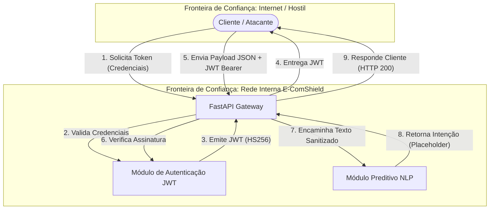

# 🗺️ Diagrama de Fluxo de Dados (DFD) & Fronteiras de Confiança

O diagrama abaixo mapeia a arquitetura da API E-ComShield, evidenciando as zonas de risco e o fluxo de inferência preditiva.

## 📊 Diagrama Arquitetural (Mermaid)

